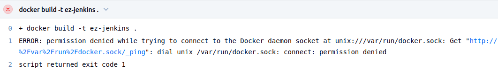

# 🚀 Jenkins CI/CD Pipeline for Dockerized Web App

This project demonstrates a complete CI/CD pipeline using **Jenkins**, **GitHub**, and **Docker**. It automatically builds and deploys a simple static website whenever changes are pushed to the GitHub repository.

---


---

## 🧰 Prerequisites

- Jenkins installed (locally or on a server)
- Docker installed and running
- GitHub account and repository
- Ngrok (optional, for exposing Jenkins to GitHub webhook)

---

## ⚙️ Step-by-Step Setup

### 1. Clone the Repository

```bash
git clone https://github.com/SamuelEzra/jenkins-pipeline.git
cd jenkins-pipeline
```
---

### 2. Create `index.html`

This is the static site content served by Nginx.


---

### 3. Create `Dockerfile`


---

### 4. Create `jenkinsfile`


---

### 5. Configure Jenkins Job

- Go to Jenkins dashboard → New Item

- Select Pipeline, name it (e.g., ez-jenkins)

- Under Triggers, select 'GitHub hook trigger for GITScm polling'

- Under Pipeline → Definition, choose Pipeline script from SCM

- Set:

    - SCM: Git

    - Repo URL: (e.g https://github.com/SamuelEzra/jenkins-pipeline.git)

    - Branch: */main

    - Script Path: Jenkinsfile

    - Save

---

### 6. Add GitHub Webhook

- Go to GitHub repo → Settings → Webhooks

- Add:

    - Payload URL: https://[your-ngrok-url]/github-webhook/

    - Content type: application/json

    - Event: “Just the push event”

---

### 7. Run the Pipeline

- Push a change to the repo:
    ```bash
    git commit -m "Trigger pipeline"
    git push origin main
    ```
- Jenkins will:

    - Pull the latest code

    - Build the Docker image

    - Run the container on port 8081

---

## Additional (for security)

### Configure Docker Hub Token in Jenkins Pipeline

🧱 **1. Generate Docker Hub Access Token**

- Go to `Docker Hub`

- Click your profile → Account Settings → Security

- Click New Access Token

- Name it (e.g., jenkins-ci-token)

- Choose Read & Write

- Click Generate and copy the token immediately

--- 
🔐 **2. Add Token to Jenkins Credentials**

- Go to Jenkins dashboard → Manage Jenkins → Credentials

- Choose (global) → Add Credentials

- Select:

    - Kind: Username and Password

    - Username: Your Docker Hub username

    - Password: The access token you just generated

    - ID: docker-hub-creds (or any name you’ll reference in your pipeline)

    - Description: Docker Hub token for CI/CD

--- 

🧪 **3. Use Token in Your Jenkinsfile**

Update your pipeline to authenticate before building:

Add the Jenkins stage below using your custom ID


## Troubleshooting

**Jenkins' Reverse Proxy Issue:** 

On Jenkins, Go to Manage Jenkins > System Configuration > System > Jenkins Location. Add ngrok URL in the Jenkins URL space.


**Docker *permission denied* error:**



Add Jenkins User to Docker Group

```sh
sudo usermod -aG docker jenkins
sudo systemctl restart jenkins
```
*Happy Automating with Jenkins!*